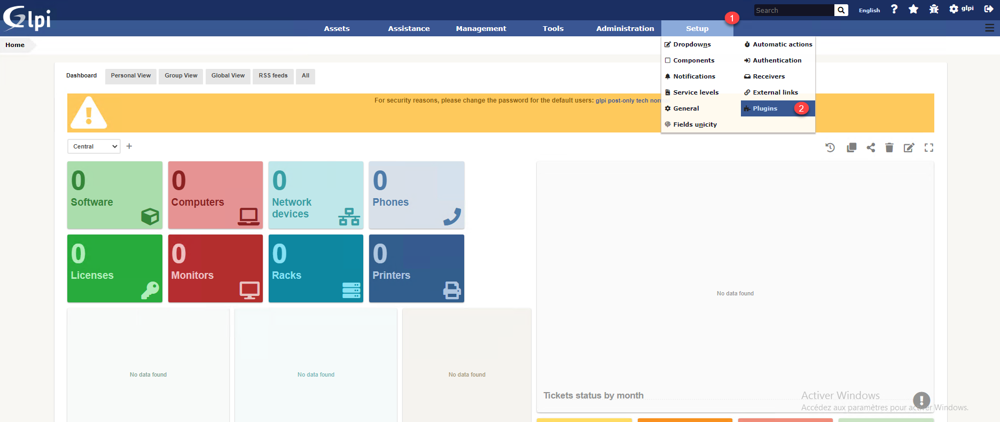
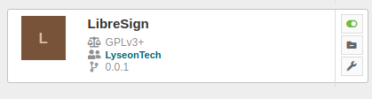
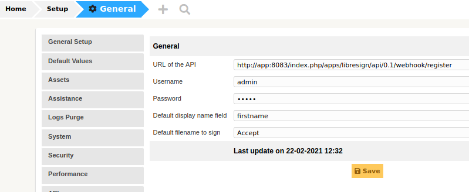
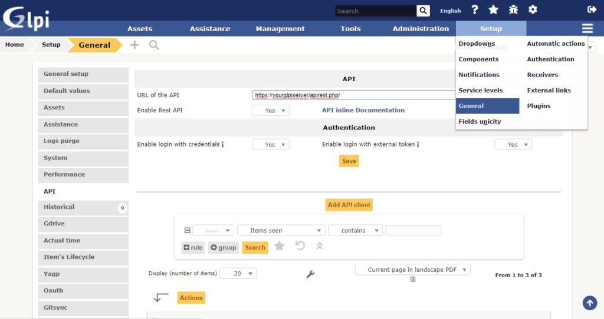
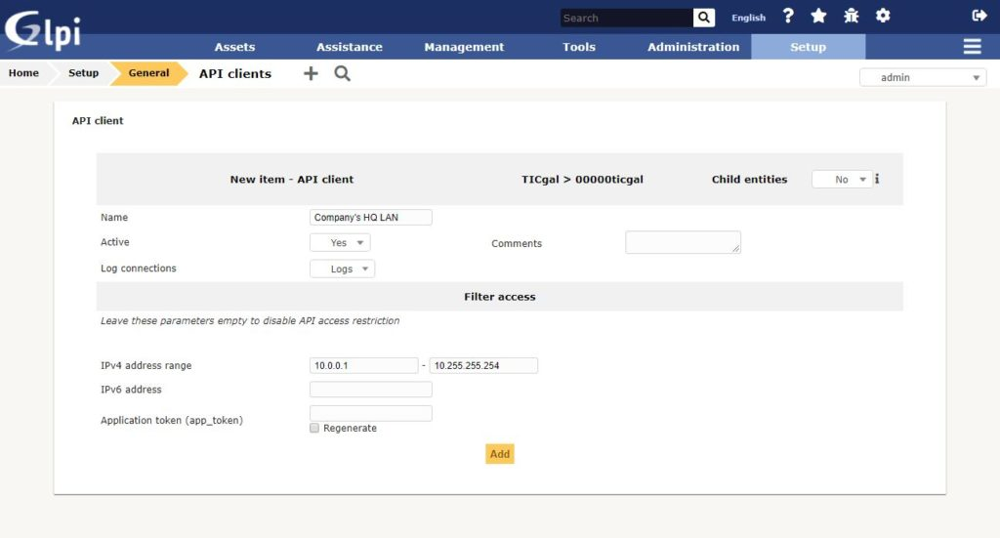

# Install

* Download latest release of plugin
* Extract in plugin directory
* Go to `Setup` > `Plugin`

* Install and enable plugin

* Go to settings of plugin and configure data to access LibreSign API

> PS: Generate app password in Nextcloud by going to `settings` > `security` > `app password`

* Go to `General` > `API`

* Add the IP addresses that are allowed to access the API. This will be the address of the LibreSign server. To do this click in `Add API client`:

* Don't fill Application token

